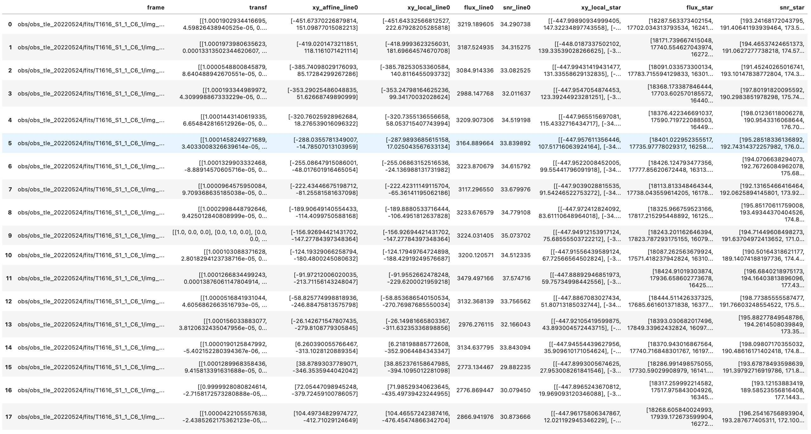
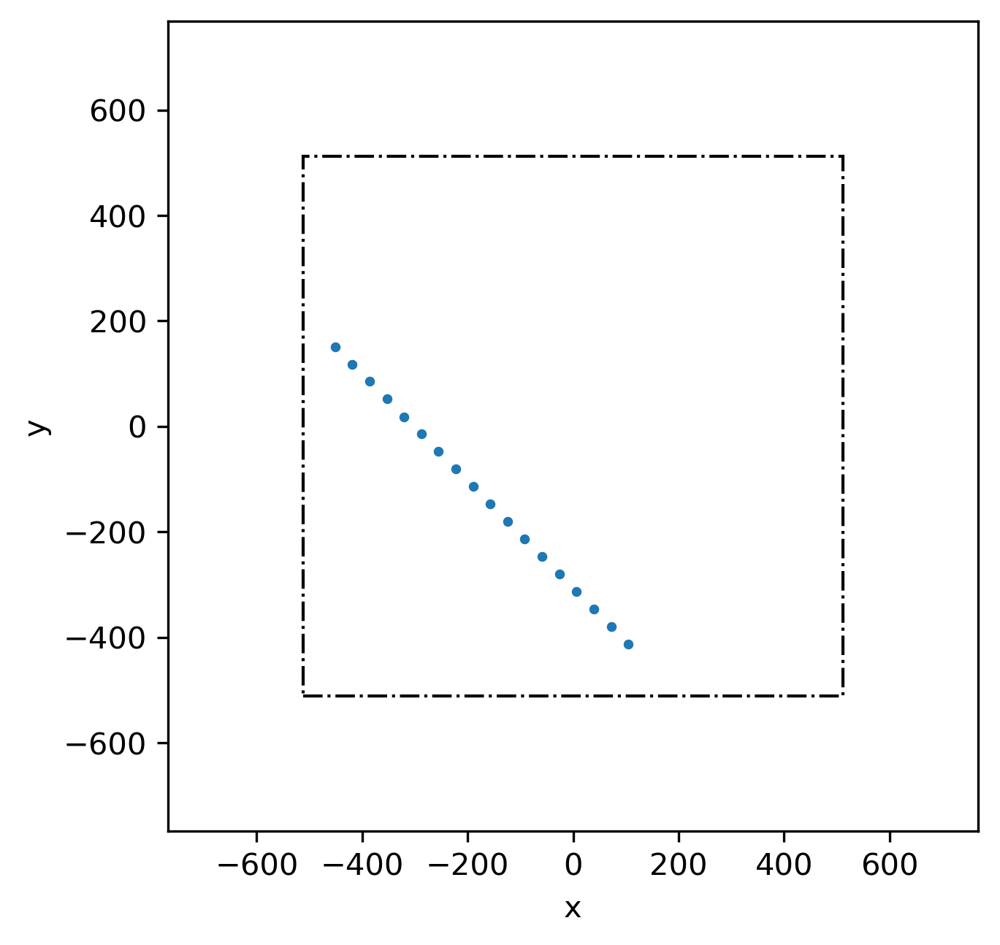

# Welcome to the SOTFINDER package

[](https://pypi.python.org/pypi/sotfinder/) [](https://pypi.python.org/pypi/sotfinder/) [](https://pypi.python.org/pypi/sotfinder/) [](https://GitHub.com/lcx366/SOTFINDER/graphs/contributors/) [](https://GitHub.com/lcx366/SOTFINDER/graphs/commit-activity) [](https://github.com/lcx366/SOTFINDER/blob/master/LICENSE) [](http://sotfinder.readthedocs.io/?badge=latest) [](https://travis-ci.org/lcx366/sotfinder)

SOTFINDER, short for Space Objects Trajectories Finder, is a tool designed for the analysis of multi-frame astronomical images. It aligns frames using star backgrounds, identifies object motion paths using the RANSAC method, and calculates the centroid and brightness of space objects and stars. SOTFINDER aims to offer a practical solution for astronomers and researchers delving into the dynamics of space objects.

## Key Features

- **Affine Transformation Calculation**: Determines the affine transformations between multiple local frames and a reference frame, using the star background for alignment.
- **Sequential RANSAC Trajectory Identification**: Utilizes the sequential RANSAC (Random Sample Consensus) method to identify and follow the motion paths of various space objects across frames.
- **Object Centroid and Brightness Calculation**: Calculates the centroid pixel coordinates and brightness (grayscale value) of spatial objects in both local and reference frames.
- **Star Centroid and Brightness Analysis**: Provides calculations for the centroid pixel coordinates and brightness of stars in the local frame, supporting astronomical analysis.
- **Visualization of Space Object Trajectories**: Offers tools for the visual representation of the trajectories, enhancing the understanding of object movements.

## How to Install

On Linux, macOS and Windows architectures, the binary wheels can be installed using `pip` by executing one of the following commands:

```
pip install sotfinder
pip install sotfinder --upgrade # to upgrade a pre-existing installation
```

### Dependencies

SOTFINDER integrates several external Python libraries and functionalities for its core operations. Here are the key dependencies and their roles within SOTFINDER:

1. **Photutils**: This Python package is central to SOTFINDER, used primarily for centroid extraction and photometric measurements in astronomical imaging data. It provides the core functionality for analyzing and processing image data. For more information, visit [Photutils Documentation](https://photutils.readthedocs.io/en/stable/).

2. **Astroalign**: A modified version of [Astroalign](https://astroalign.quatrope.org/en/latest/) is incorporated directly into SOTFINDER, meaning that Astroalign does not require separate installation.

3. **STAREXTRACTOR**: Although STAREXTRACTOR builds upon the capabilities of Photutils, it is an independent package that needs to be installed separately. More details can be found on the [STAREXTRACTOR GitHub Repository](https://github.com/lcx366/STAREXTRACTOR/tree/main).

Note: Keeping these dependencies updated is important for the compatibility and optimal performance of SOTFINDER.

## How to use

### Extracting the Trajectories of Moving Objects

The following animation illustrates the motion of space objects relative to the star background, providing a clear visual understanding of their trajectories:

<p align="middle">
  
</p>

To load multiple frames of images and find the trajectories of moving objects:

```python
>>> from sotfinder import find_moving
>>> image_dir = 'obs/obs_tle_20220524/fits/T1616_S1_1_C6_1/'
>>> traces = find_moving(image_dir)
>>> print(traces)
>>> # <Trace object: RES = (1024, 1024) FWHM ≈ 9.63 REF_INDEX = 9 NUM_FRAMES = 18 NUM_TRACES = 1>
```

Attributes of `traces` include:

- `res`: The resolution of the observation image.
- `fwhm`: Full Width at Half Maximum (FWHM) values of the image.
- `offset`: Coordinates of the image center relative to the original coordinate origin.
- `frames`: List of image frames.
- `lineX` (e.g., `line0`, `line1`, ...): Objects representing detected trajectories.
- `stars`: Object containing information about stars in each frame.
- `df`: DataFrame with affine transformations, trajectories, and stars details.
- `_ref_ind`: Index of the reference frame.
- `_image`: The background-subtracted grayscale image.
- `_xy_candis`: Candidate coordinates for moving objects.
- `_num_frames`: Total number of frames.
- `_num_traces`: Total number of detected trajectories.

```python
>>> print(traces.line0)
>>> # <Line object: NUM_POINTS = 18>
>>> print(traces.stars)
>>> # <Stars object: NUM_STARS = 87>
>>> print(traces.df)
```

The output dataframe contains key information about affine transformations, motion trajectories, and stars:

```python
>>> print(traces.df)
```

<p align="middle">
  
</p>

Visualizing the trajectories of moving objects:

```python
>>> traces.show() # Plot trajectories of the moving space objects 
```

<p align="middle">
  
</p>

### Save to HDF5 Files

Handling HDF5 files with SOTFINDER involves saving, previewing, and loading data.

To save the data from `traces` into an HDF5 file:

```python
>>> traces.savehdf5('traces.hdf5')
```

This creates an HDF5 file named 'traces.hdf5' containing all the relevant data from the traces object.

To preview the structure of the HDF5 file:

```bash
$ h5dump -H traces.hdf5
```

This command provides a header-only view of the HDF5 file, showing its structure and layout without loading the entire file content.

To read data from an HDF5 file back into the program:

```python
>>> traces_ = from_hdf5('traces.hdf5')
```

It reads the data from 'traces.hdf5' and initializes a new Traces object with the loaded data.

## Change log

- **0.0.1 — Nov 14,  2023**
  - Initial release of ***sotfinder***.
  - Key functionalities such as affine transformation calculation, sequential RANSAC trajectory identification, and photometric analysis of space objects.
  - Tools for the visualization of space object trajectories.
  - Functionality for handling and processing HDF5 files.
  - Comprehensive documentation and examples for ease of use.

## Next Release

- Implementation of trajectory detection for both analytical and non-analytical shaped trajectories using RANSAC and Generalized Hough Transform. This enhancement broadens the scope of detectable trajectories, accommodating a wider variety of space object movements.
- Enhanced stability in the sequential RANSAC algorithm for more consistent and reliable identification of motion trajectories. This update aims to refine the accuracy of trajectory tracking and reduce potential anomalies.
- Improved visualization features including distinct markers for moving space objects and stars, enhancing clarity and distinction in visual data analysis.

# Contributing

We welcome contributions to the SOTFINDER project and are grateful for every bit of help. 

- **Bug Reports**: If you find a bug, please create an issue in our issue tracker. Be sure to include detailed information about the bug and steps to reproduce it.
- **Feature Requests**: If you have ideas for new features or improvements, feel free to open an issue to discuss them.

# Reference

This section lists the references and key resources that have contributed to the development and understanding of the methodologies implemented in the SOTFINDER package.

- **RANSAC Algorithm**: For an overview of the RANSAC algorithm, refer to this [article by Olli Myllymäki](https://omyllymaki.medium.com/algorithms-from-scratch-ransac-f5a03bed2fde) which explains the RANSAC algorithm from scratch.

- **Sequential RANSAC**: This [Medium article](https://medium.com/mlearning-ai/recursive-ransac-approach-to-find-all-straight-lines-in-an-image-b5c510a0224a) discusses the recursive or sequential approach to RANSAC for identifying multiple straight lines in an image.

- **Generalized Hough Transform**: For understanding the extension of the Hough transform to detect arbitrary shapes, refer to the seminal work by Ballard, D.H. (1981) in "Generalizing the Hough transform to detect arbitrary shapes", published in Pattern Recognition, 13 (2): 111–122.

- **Optimal RANSAC**: Hast, A., Nysjö, J., & Marchetti, A. (2013) discuss the optimal RANSAC approach in their paper "Optimal RANSAC - towards a repeatable algorithm for finding the optimal set", providing insights into making the RANSAC algorithm more repeatable and reliable.